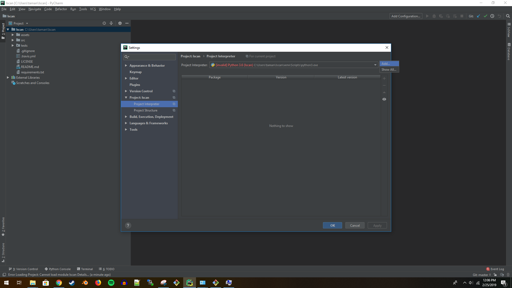
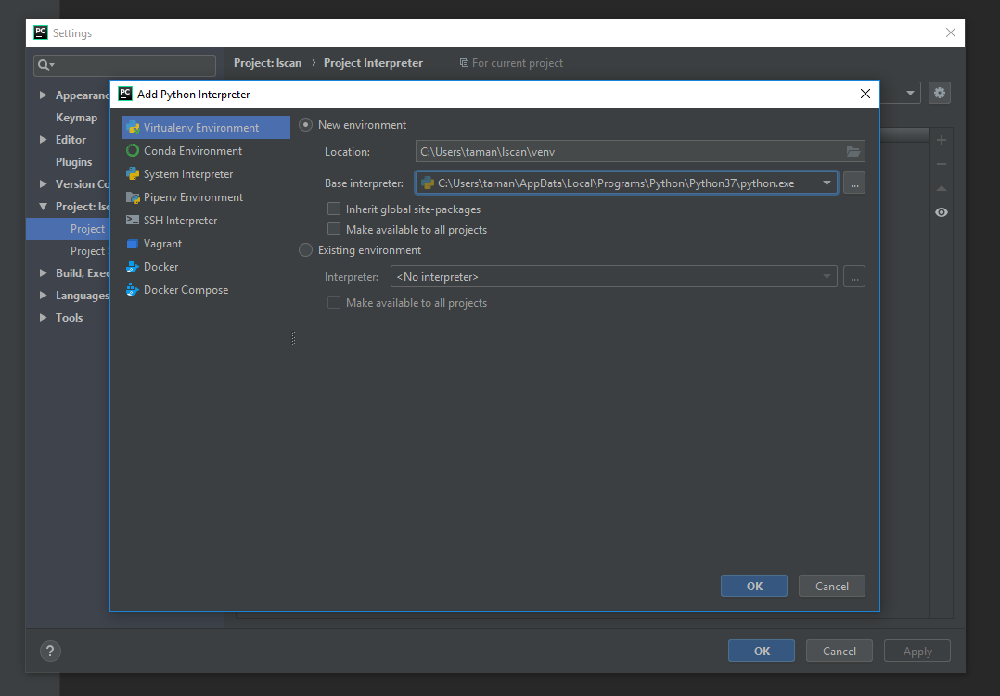
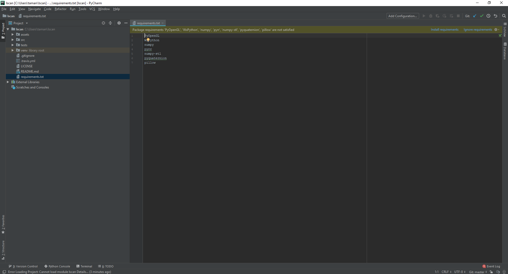
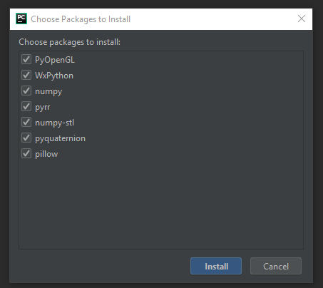
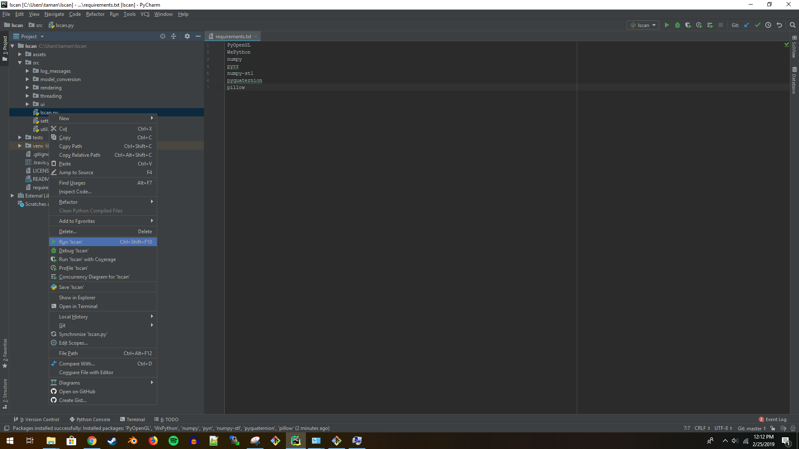
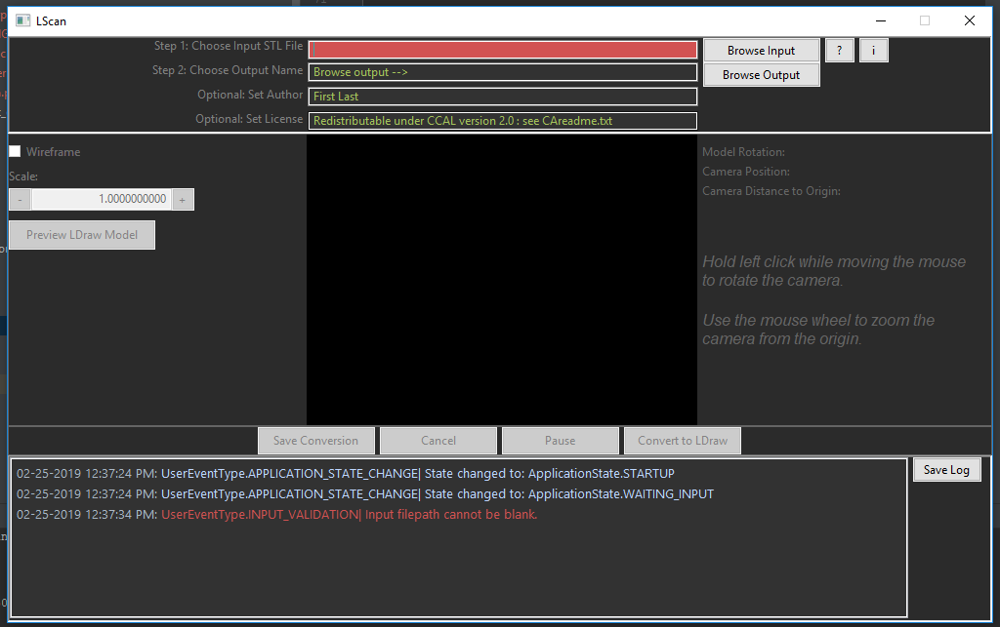
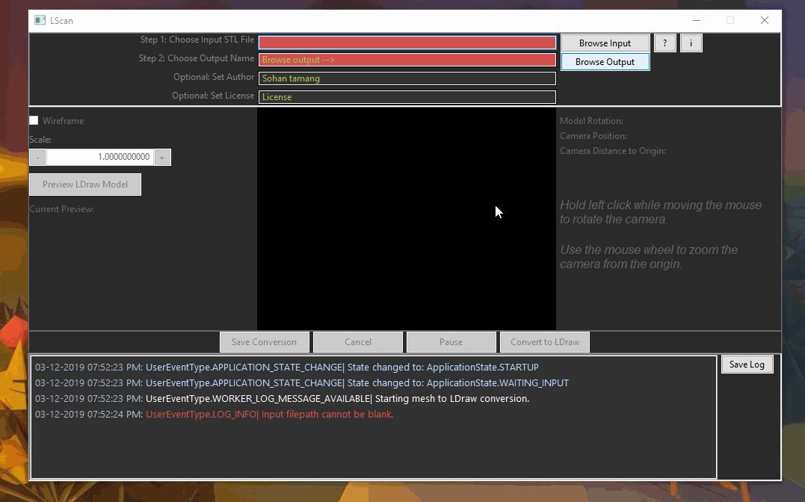

# LScan

Travis CI 

## What is this repository for? ##

The LScan project is a standalone piece of software that will be used to convert 3D STL files of Lego parts to a valid 
[LDraw](https://www.ldraw.org/) parts definition file. It is written in Python.

* This repository contains the 2018-2019 capstone team project for computer science with professor Bart Massey.
* Find the documentation here: https://bgoldbeck.github.io/lscan/docs/index.html

## Dependencies ##
- [Python3](https://docs.python.org/3.6/)
- [PyOpenGL](http://pyopengl.sourceforge.net/)
- [WxPython](https://wxpython.org/)
- [Numpy](http://www.numpy.org/)
- [Numpy-STL](https://pypi.org/project/numpy-stl/)
- [Pyrr](https://pypi.org/project/pyrr/)
- [PyQuaternion](http://kieranwynn.github.io/pyquaternion/)
- [Pillow](https://pillow.readthedocs.io/en/stable/index.html)

## Setting up for Development ##

Before setting up this project, download latest version of Python3
- **Mac OS** 

    `$ brew install python3`
    
    (Note: If your Mac does not have `brew` visit https://brew.sh/ to install HomeBrew)
- **Windows OS**

    - Visit https://www.python.org/downloads/ to download latest version of Python3
    - Download latest Git Bash from https://git-scm.com/downloads

Follow the following steps to setup **LScan**

We recommend [PyCharm](https://www.jetbrains.com/pycharm/) for an IDE for this project. If you use pycharm you can skip step 2 and step 3. You can use PyCharm's settings to setup the environment.

## Setup Using PyCharm ##
1. Open PyCharm and load LScan project

2. Add Python interpreter.

    - Click `File` -> `Settings` -> `Project Interpreter` - in Windows OS
    - Click `Pycharm`-> `Preferences` -> `Project Interpreter` - in Mac OS
    - Click :gear: and click `Add...`
     
    - Add base interpreter and click `OK`
    
    
3. Follow these steps to install dependencies.
    - Open `requirements.txt`
    - Click `Install requirements` to top right corner.
    
    - A window with packages list appears. Select all and click `Install`
    

4. Right click `src/lscan.py` and click `Run` to test the environment setup.
   

5. Development environment is complete once LScan runs without any issues.
   
  
## Setup Without PyCharm ##  
Follow these steps if you are not using PyCharm.
 
### Mac OS ###
Open terminal and follow these steps.

1. From the terminal clone LScan repo

    `$ git clone https://github.com/bgoldbeck/lscan.git`

2. Change directory to **lscan**

    `$ cd lscan`

3. Install dependencies

    `$ pip install -r requirements.txt`

### Windows OS ###

Open Git Bash and follow these steps.

1. Clone LScan repo

    `$ git clone https://github.com/bgoldbeck/lscan.git`

2. Change directory to **lscan**

    `$ cd lscan`

3. Install dependencies

    `$ pip install -r requirements.txt`
    

## How to Use LScan ###
Follow these steps to convert a valid STL model files to LDraw format.

1. Click `Browse Input` to choose a STL file.
2. Click `Browse Output` to choose an output name.
3. Enter your name in `Set Author` text box.
4. Enter a license text in `Set License` text box.
5. Click `Convert to LDraw` button to start conversion.
5. Click `Save Conversion` button to save the LDraw file.

The converted file is in LDraw `.dat` format. To view the LDraw model, visit https://www.ldraw.org/documentation/help/getting-started.html
and download a CAD software for your operating system. Click [LDView](http://ldview.sourceforge.net/) to download a popular LDraw model viewer. 

## Bug Tracker ##
https://github.com/bgoldbeck/lscan/issues

# License

**LScan** is licensed under MIT License. Read [LICENSE](LICENSE) for license details. 

## Contact Us ##
Brandon Goldbeck: bpg@pdx.edu  
Anthony Namba: anamba@pdx.edu  
Brandon Le: lebran@pdx.edu  
Ann Peake: peakean@pdx.edu  
Sohan Tamang: sohan@pdx.edu  
Theron Anderson: atheron@pdx.edu  
An Huynh: anvanphuchuynh@gmail.com  

## Copyright ##
Copyright (C) 2018 
"Brandon Goldbeck", "Anthony Namba", "Brandon Le", "Ann Peake", "Sohan Tamang", "Theron Anderson", "An Huynh"
